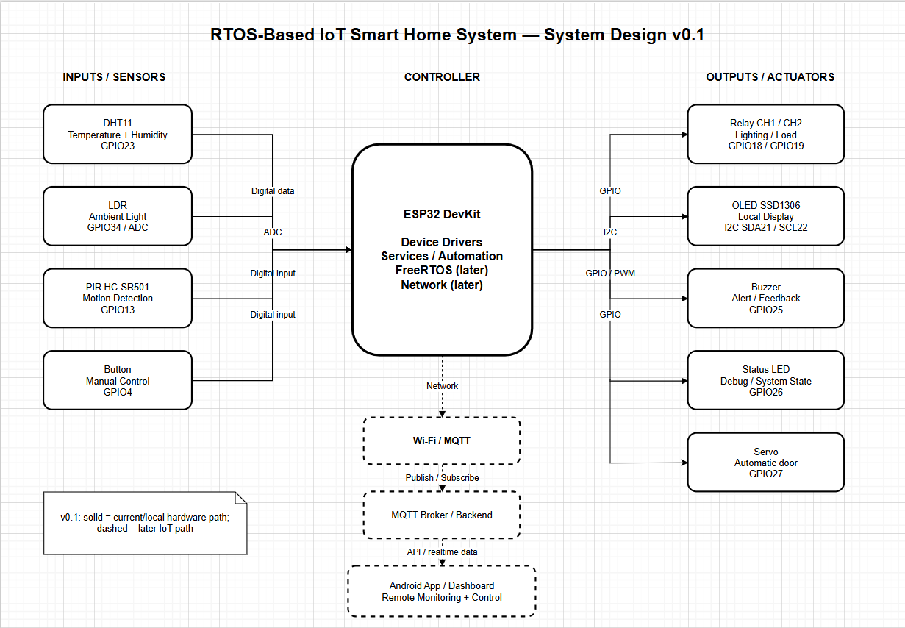

# RTOS-Based IoT Smart Home System

## Overview
Project giới thiệu ngắn gọn hệ thống Smart Home và mục tiêu.

## Features
- Environmental monitoring
- Smart lighting
- Motion detection
- Local display
- Manual control
- Remote monitoring/control via MQTT (planned)

## System Architecture
